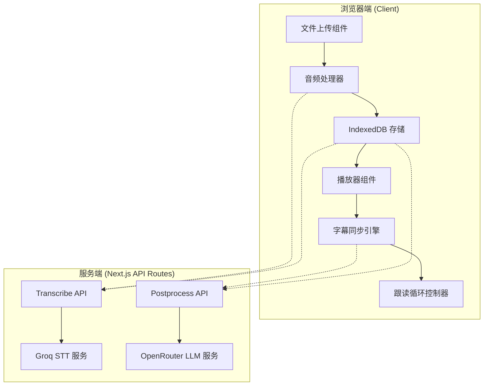
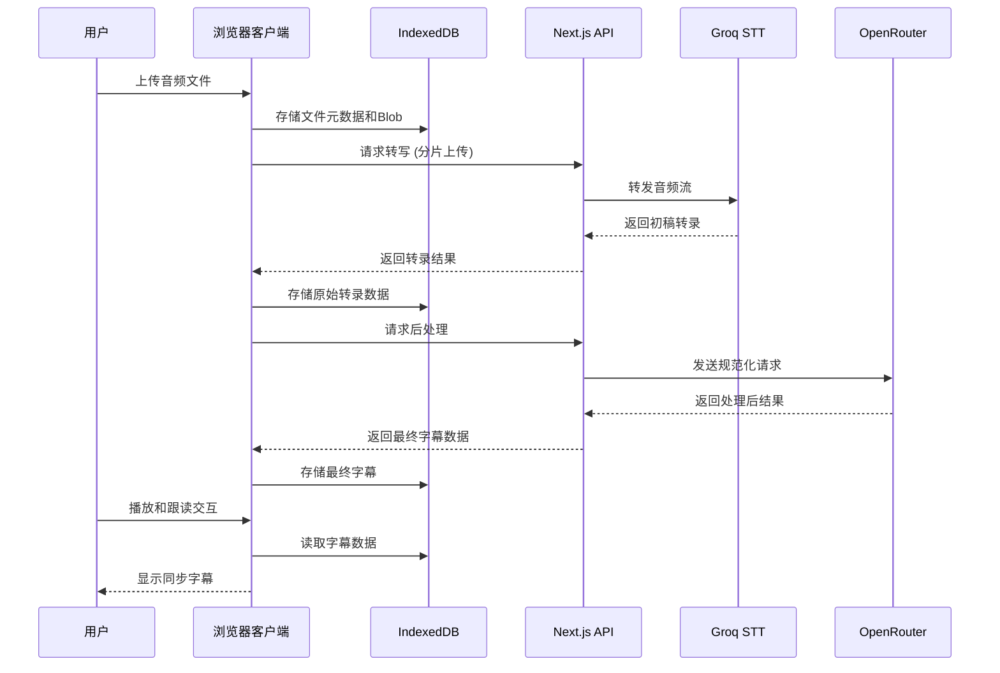

# 影子跟读/Shadowing 项目架构设计文档

## 1. 系统架构概览

### 1.1 组件架构图



### 1.2 数据流图



## 2. 技术栈详细说明

### 2.1 前端技术栈
- **框架**: Next.js 14+ (App Router)
- **语言**: TypeScript 5+
- **UI组件**: React 18 + shadcn/ui + Lucide Icons
- **样式**: Tailwind CSS
- **状态管理**: React状态 + IndexedDB持久化
- **音频处理**: Web Audio API
- **数据库**: Dexie (IndexedDB封装)

### 2.2 后端技术栈
- **运行时**: Node.js (Next.js API Routes)
- **API客户端**: 原生fetch + FormData处理
- **验证**: Zod schema验证
- **流处理**: 原生Stream API

### 2.3 外部服务集成
- **语音转写**: Groq Whisper-large-v3
- **文本处理**: OpenRouter (支持多种LLM模型)
- **可选增强**: kuromoji.js (本地日语处理)

## 3. 数据库设计 (IndexedDB Schema)

### 3.1 核心数据表结构

```typescript
// FileRow - 音频文件存储
export interface FileRow {
  id: string;                 // UUID v4
  name: string;               // 原始文件名
  type: string;               // MIME类型 (audio/*)
  duration?: number;          // 音频时长(秒)
  createdAt: number;          // 创建时间戳
  blob: Blob;                 // 原始音频数据
  peaks?: Float32Array;       // 波形数据(可选)
  status: 'ready' | 'processing' | 'done' | 'error'; // 处理状态
  error?: string;             // 错误信息(可选)
}

// TranscriptRow - 转录结果存储
export interface TranscriptRow {
  id: string;                 // UUID v4
  fileId: string;             // 外键关联FileRow
  provider: 'groq-whisper';   // 转录服务提供商
  model: 'whisper-large-v3';  // 模型版本
  lang?: string;              // 检测到的主要语言
  segments: Segment[];        // 规范化后的最终段落
  raw?: any;                  // 原始转录数据(用于调试)
  glossaryVersion?: string;   // 术语库版本号
  createdAt: number;          // 创建时间戳
  hasWordLevel: boolean;      // 是否包含词级时间戳
  processingTime?: number;    // 处理耗时(毫秒)
}

// Segment - 句子段落
export interface Segment {
  id: string;                 // UUID v4
  start: number;              // 开始时间(秒)
  end: number;                // 结束时间(秒)
  text: string;               // 规范化文本
  lang?: string;              // 句子语言代码
  translation?: {             // 翻译结果
    zh?: string;              // 中文翻译
    en?: string;              // 英文翻译(可选)
  };
  reading?: string;           // 假名/拼音标注
  terms?: {                   // 术语统一记录
    src: string;              // 原始术语
    norm: string;             // 规范化术语
  }[];
  words?: {                   // 词级时间戳(可选)
    start: number;            // 词开始时间
    end: number;              // 词结束时间
    text: string;             // 词文本
  }[];
}

// GlossaryRow - 术语库
export interface GlossaryRow {
  id: string;                 // UUID v4
  src: string;                // 源术语
  norm: string;               // 规范化术语
  lang: string;               // 语言代码
  category?: string;          // 分类(可选)
  createdAt: number;          // 创建时间戳
  updatedAt: number;          // 更新时间戳
}
```

### 3.2 数据库索引设计

```typescript
// Dexie 数据库配置
export const db = new Dexie('ShadowingDB');

db.version(1).stores({
  files: '++id, name, createdAt, status',
  transcripts: '++id, fileId, createdAt, lang',
  glossary: '++id, src, norm, lang, category',
  jobLogs: '++id, fileId, timestamp, type'
});
```

## 4. API设计 (前后端接口规范)

### 4.1 转录API (`/api/transcribe`)

**请求方法**: POST
**Content-Type**: multipart/form-data

**请求参数**:
```typescript
// Query Parameters
interface TranscribeQuery {
  fileId: string;      // 文件ID
  chunkIndex?: number; // 分片索引(可选)
  offsetSec?: number;  // 时间偏移(秒)
}

// FormData 字段
const formData = new FormData();
formData.append('audio', blob); // 音频Blob
formData.append('meta', JSON.stringify({
  fileId: string,
  idx: number,
  start: number,
  end: number,
  totalChunks: number
}));
```

**响应格式**:
```typescript
interface TranscribeResponse {
  ok: boolean;
  chunkIndex: number;
  data: {
    text: string;
    segments: Array<{
      start: number;
      end: number;
      text: string;
      words?: Array<{
        start: number;
        end: number;
        text: string;
      }>;
    }>;
  };
  error?: string;
}
```

### 4.2 后处理API (`/api/postprocess`)

**请求方法**: POST
**Content-Type**: application/json

**请求体**:
```typescript
interface PostProcessRequest {
  fileId: string;
  segments: Array<{
    start: number;
    end: number;
    text: string;
  }>;
  glossary?: Array<{
    src: string;
    norm: string;
  }>;
  targetLangs: string[]; // ['zh', 'en']
  preferReading: string; // 'ja'
}
```

**响应格式**:
```typescript
interface PostProcessResponse {
  ok: boolean;
  data: {
    lang: string;
    segments: Array<{
      id: string;
      start: number;
      end: number;
      text: string;
      lang?: string;
      translation?: {
        zh?: string;
        en?: string;
      };
      reading?: string;
      terms?: Array<{
        src: string;
        norm: string;
      }>;
      words?: Array<{
        start: number;
        end: number;
        text: string;
      }>;
    }>;
  };
  error?: string;
}
```

### 4.3 错误码规范

| 错误码 | 描述 | 处理建议 |
|--------|------|----------|
| `stt_429` | Groq API 频率限制 | 指数退避重试 |
| `stt_5xx` | Groq 服务错误 | 重试或降级 |
| `openrouter_parse_error` | OpenRouter 解析失败 | 重试或降级处理 |
| `schema_validation_failed` | 数据验证失败 | 检查输入格式 |
| `audio_too_large` | 音频文件过大 | 分片处理 |
| `invalid_audio_format` | 不支持的音频格式 | 转换格式 |

## 5. 核心算法和数据处理流程

### 5.1 音频分片算法

```typescript
/**
 * 音频分片处理
 * @param blob 音频Blob
 * @param chunkSeconds 分片时长(秒)
 * @param overlap 重叠时长(秒)
 */
async function* sliceAudio(
  blob: Blob,
  chunkSeconds: number = 45,
  overlap: number = 0.2
): AsyncGenerator<AudioChunk> {
  const duration = await getAudioDuration(blob);
  let currentStart = 0;
  let chunkIndex = 0;

  while (currentStart < duration) {
    const chunkEnd = Math.min(duration, currentStart + chunkSeconds);

    // 使用Web Audio API进行精确分片
    const audioBuffer = await decodeAudioData(blob);
    const chunkBuffer = extractAudioChunk(audioBuffer, currentStart, chunkEnd);
    const chunkBlob = await encodeAudioToWav(chunkBuffer);

    yield {
      index: chunkIndex,
      start: currentStart,
      end: chunkEnd,
      blob: chunkBlob,
      duration: chunkEnd - currentStart
    };

    chunkIndex++;
    currentStart = chunkEnd - overlap; // 应用重叠
  }
}
```

### 5.2 转录结果合并算法

```typescript
/**
 * 合并分片转录结果
 * @param chunks 各分片转录结果
 * @param overlap 重叠时长
 */
function mergeTranscriptChunks(
  chunks: TranscriptChunk[],
  overlap: number = 0.2
): MergedTranscript {
  const segments: Segment[] = [];

  chunks.sort((a, b) => a.start - b.start);

  for (let i = 0; i < chunks.length; i++) {
    const chunk = chunks[i];
    const nextChunk = chunks[i + 1];

    // 处理重叠区域
    if (nextChunk && chunk.end > nextChunk.start) {
      const overlapStart = nextChunk.start;
      const overlapEnd = Math.min(chunk.end, nextChunk.start + overlap);

      // 使用文本相似度算法选择最佳重叠处理
      const bestSegments = resolveOverlap(
        chunk.segments,
        nextChunk.segments,
        overlapStart,
        overlapEnd
      );

      segments.push(...bestSegments);
    } else {
      segments.push(...chunk.segments);
    }
  }

  return { segments };
}

// 重叠解析算法
function resolveOverlap(
  prevSegments: Segment[],
  nextSegments: Segment[],
  overlapStart: number,
  overlapEnd: number
): Segment[] {
  // 实现基于文本相似度的重叠处理
  // 使用Jaro-Winkler距离或编辑距离
  const similarity = calculateTextSimilarity(
    getTextInRange(prevSegments, overlapStart, overlapEnd),
    getTextInRange(nextSegments, overlapStart, overlapEnd)
  );

  if (similarity > 0.8) {
    // 高度相似，选择质量更高的片段
    return selectBetterSegments(prevSegments, nextSegments, overlapStart, overlapEnd);
  } else {
    // 差异较大，保留两个版本或使用LLM决策
    return handleDivergentOverlap(prevSegments, nextSegments, overlapStart, overlapEnd);
  }
}
```

### 5.3 字幕同步算法

```typescript
/**
 * 二分查找当前句子
 * @param currentTime 当前播放时间
 * @param segments 句子数组
 */
function findCurrentSegment(
  currentTime: number,
  segments: Segment[]
): { segment: Segment | null; index: number } {
  const starts = segments.map(s => s.start);
  let left = 0;
  let right = starts.length - 1;

  while (left <= right) {
    const mid = Math.floor((left + right) / 2);

    if (currentTime < starts[mid]) {
      right = mid - 1;
    } else if (mid === starts.length - 1 || currentTime < starts[mid + 1]) {
      // 检查是否在当前句子时间范围内
      const segment = segments[mid];
      if (currentTime >= segment.start && currentTime <= segment.end) {
        return { segment, index: mid };
      }
      break;
    } else {
      left = mid + 1;
    }
  }

  return { segment: null, index: -1 };
}

/**
 * 词级高亮查找
 * @param currentTime 当前时间
 * @param words 词级时间戳数组
 */
function findCurrentWord(
  currentTime: number,
  words: Word[]
): { word: Word | null; index: number } {
  // 类似句子查找，但针对词级粒度
  const starts = words.map(w => w.start);
  let left = 0;
  let right = starts.length - 1;

  while (left <= right) {
    const mid = Math.floor((left + right) / 2);

    if (currentTime < starts[mid]) {
      right = mid - 1;
    } else if (mid === starts.length - 1 || currentTime < starts[mid + 1]) {
      const word = words[mid];
      if (currentTime >= word.start && currentTime <= word.end) {
        return { word, index: mid };
      }
      break;
    } else {
      left = mid + 1;
    }
  }

  return { word: null, index: -1 };
}
```

### 5.4 跟读循环控制算法

```typescript
class LoopController {
  private audio: HTMLAudioElement;
  private loop: { start: number; end: number } | null = null;
  private loopCount: number = 0;
  private maxLoops: number = Infinity;
  private isActive: boolean = false;

  constructor(audio: HTMLAudioElement) {
    this.audio = audio;
    this.audio.addEventListener('timeupdate', this.handleTimeUpdate.bind(this));
  }

  setLoop(start: number, end: number, maxLoops: number = Infinity) {
    this.loop = { start, end };
    this.maxLoops = maxLoops;
    this.loopCount = 0;
    this.isActive = true;

    this.audio.currentTime = start;
    this.audio.play();
  }

  stopLoop() {
    this.isActive = false;
    this.loop = null;
  }

  private handleTimeUpdate() {
    if (!this.isActive || !this.loop) return;

    const currentTime = this.audio.currentTime;
    const epsilon = 0.05; // 50ms容差

    if (currentTime >= this.loop.end - epsilon) {
      this.loopCount++;

      if (this.loopCount >= this.maxLoops) {
        this.stopLoop();
        // 可选择继续播放或暂停
        this.audio.currentTime = this.loop.end;
      } else {
        // 回到循环起点
        this.audio.currentTime = this.loop.start;
      }
    }
  }
}
```

## 6. 安全性和隐私保护措施

### 6.1 数据安全

1. **本地存储**: 所有用户数据存储在浏览器IndexedDB中，不上传至服务器持久化
2. **音频处理**: 音频文件仅在转写时临时流式传输，服务端不落盘
3. **内存安全**: 服务端处理完成后立即释放音频数据内存
4. **传输加密**: 所有API通信使用HTTPS加密

### 6.2 隐私保护

1. **无用户追踪**: 不收集任何用户身份信息
2. **数据自主权**: 用户可随时清空所有本地数据
3. **服务商选择**: 使用隐私友好的Groq和OpenRouter服务
4. **透明处理**: 明确告知用户数据处理流程

### 6.3 安全配置

```typescript
// Next.js API路由安全配置
export const config = {
  runtime: 'nodejs',
  api: {
    bodyParser: false, // 禁用默认body解析，使用流处理
    responseLimit: false, // 禁用响应大小限制
  },
};

// 安全头设置
export function setSecurityHeaders(headers: Headers) {
  headers.set('Cache-Control', 'no-store, no-cache, must-revalidate');
  headers.set('Pragma', 'no-cache');
  headers.set('X-Content-Type-Options', 'nosniff');
  headers.set('X-Frame-Options', 'DENY');
  headers.set('X-XSS-Protection', '1; mode=block');
}
```

### 6.4 输入验证和清理

```typescript
// 文件上传验证
function validateAudioFile(file: File): ValidationResult {
  const maxSize = 100 * 1024 * 1024; // 100MB
  const allowedTypes = [
    'audio/mpeg',
    'audio/wav',
    'audio/webm',
    'audio/ogg',
    'audio/m4a'
  ];

  if (file.size > maxSize) {
    return { valid: false, error: 'FILE_TOO_LARGE' };
  }

  if (!allowedTypes.includes(file.type)) {
    return { valid: false, error: 'INVALID_FILE_TYPE' };
  }

  return { valid: true };
}

// API输入验证
const transcribeSchema = z.object({
  fileId: z.string().uuid(),
  chunkIndex: z.number().int().nonnegative().optional(),
  offsetSec: z.number().nonnegative().optional()
});
```

## 7. 性能优化策略

### 7.1 前端性能优化

1. **虚拟滚动**: 长字幕列表使用虚拟滚动
2. **节流处理**: 时间更新事件节流到200ms
3. **内存管理**: 及时释放不再使用的音频资源
4. **预加载**: 预加载相邻字幕数据
5. **缓存策略**: 合理使用IndexedDB索引

### 7.2 音频处理优化

```typescript
// Web Worker中的音频处理
const audioProcessor = new Worker('/workers/audio-processor.js');

// 离线音频上下文处理
export async function precomputeWaveform(blob: Blob): Promise<Float32Array> {
  const audioContext = new OfflineAudioContext(1, 44100, 44100);
  const arrayBuffer = await blob.arrayBuffer();
  const audioBuffer = await audioContext.decodeAudioData(arrayBuffer);

  // 下采样和峰值提取
  const channelData = audioBuffer.getChannelData(0);
  const peaks = extractPeaks(channelData, 1000); // 提取1000个峰值点

  return peaks;
}

// 峰值提取算法
function extractPeaks(data: Float32Array, targetLength: number): Float32Array {
  const blockSize = Math.floor(data.length / targetLength);
  const peaks = new Float32Array(targetLength);

  for (let i = 0; i < targetLength; i++) {
    const start = i * blockSize;
    const end = Math.min(start + blockSize, data.length);
    let max = 0;

    for (let j = start; j < end; j++) {
      const value = Math.abs(data[j]);
      if (value > max) max = value;
    }

    peaks[i] = max;
  }

  return peaks;
}
```

### 7.3 网络优化

1. **分片并发**: 控制并发请求数量(2-3个)
2. **指数退避**: 网络错误时使用指数退避重试
3. **压缩传输**: 文本数据使用gzip压缩
4. **缓存响应**: 合理设置API响应缓存

### 7.4 数据库优化

```typescript
// IndexedDB性能优化
const db = new Dexie('ShadowingDB', {
  autoOpen: true,
  cache: 'immutable',
  addons: [dexieCloudAddon]
});

// 批量操作优化
async function batchInsertSegments(segments: Segment[]) {
  const transaction = db.transaction('segments', 'readwrite');
  const store = transaction.objectStore('segments');

  for (const segment of segments) {
    store.add(segment);
  }

  await transaction.done;
}
```

## 8. 错误处理和监控

### 8.1 错误处理策略

```typescript
// 统一错误处理装饰器
function withErrorHandling<T extends any[]>(fn: (...args: T) => Promise<any>) {
  return async (...args: T) => {
    try {
      return await fn(...args);
    } catch (error) {
      console.error('Operation failed:', error);

      // 分类错误处理
      if (error instanceof NetworkError) {
        await handleNetworkError(error);
      } else if (error instanceof APIError) {
        await handleAPIError(error);
      } else if (error instanceof DatabaseError) {
        await handleDatabaseError(error);
      } else {
        await handleUnknownError(error);
      }

      throw error; // 重新抛出供上层处理
    }
  };
}

// 指数退避重试
async function withRetry<T>(
  operation: () => Promise<T>,
  maxRetries: number = 3,
  baseDelay: number = 1000
): Promise<T> {
  let lastError: Error;

  for (let attempt = 1; attempt <= maxRetries; attempt++) {
    try {
      return await operation();
    } catch (error) {
      lastError = error as Error;

      if (attempt === maxRetries) break;

      const delay = baseDelay * Math.pow(2, attempt - 1);
      await new Promise(resolve => setTimeout(resolve, delay));
    }
  }

  throw lastError;
}
```

### 8.2 监控和日志

```typescript
// 应用监控
interface MonitoringEvent {
  type: 'transcribe_start' | 'transcribe_success' | 'transcribe_error' |
        'postprocess_start' | 'postprocess_success' | 'postprocess_error' |
        'playback_start' | 'playback_pause' | 'loop_start' | 'loop_end';
  timestamp: number;
  duration?: number;
  fileId?: string;
  error?: string;
  metadata?: Record<string, any>;
}

class Monitor {
  private static instance: Monitor;
  private events: MonitoringEvent[] = [];

  static getInstance() {
    if (!Monitor.instance) {
      Monitor.instance = new Monitor();
    }
    return Monitor.instance;
  }

  logEvent(event: Omit<MonitoringEvent, 'timestamp'>) {
    const fullEvent: MonitoringEvent = {
      ...event,
      timestamp: Date.now()
    };

    this.events.push(fullEvent);

    // 持久化到IndexedDB
    this.persistEvent(fullEvent);

    // 开发环境输出到控制台
    if (process.env.NODE_ENV === 'development') {
      console.log('Monitor Event:', fullEvent);
    }
  }

  private async persistEvent(event: MonitoringEvent) {
    try {
      await db.jobLogs.add({
        ...event,
        id: generateId()
      });
    } catch (error) {
      console.warn('Failed to persist monitoring event:', error);
    }
  }
}
```

### 8.3 用户体验错误处理

```typescript
// Toast错误提示
function showErrorToast(error: Error, action?: () => void) {
  const errorConfig = errorConfigs[error.name] || defaultErrorConfig;

  toast.error({
    title: errorConfig.title,
    description: errorConfig.description,
    action: action ? {
      label: errorConfig.actionLabel,
      onClick: action
    } : undefined
  });
}

const errorConfigs = {
  NetworkError: {
    title: '网络连接失败',
    description: '请检查网络连接后重试',
    actionLabel: '重试'
  },
  APIError: {
    title: '服务暂时不可用',
    description: '请稍后再试',
    actionLabel: '重试'
  },
  AudioError: {
    title: '音频处理失败',
    description: '请尝试其他音频文件',
    actionLabel: '选择其他文件'
  }
};
```

## 9. 部署和配置说明

### 9.1 环境变量配置

```env
# .env.local
GROQ_API_KEY=your_groq_api_key_here
OPENROUTER_API_KEY=your_openrouter_api_key_here
OPENROUTER_BASE_URL=https://openrouter.ai/api/v1
OPENROUTER_MODEL=meta-llama/llama-3.1-70b-instruct:free

# 性能配置
MAX_CONCURRENCY=3
CHUNK_SECONDS=45
CHUNK_OVERLAP=0.2

# 可选配置
ENABLE_WAVEFORM=true
ENABLE_WORD_LEVEL=true
DEFAULT_TARGET_LANGS=zh
PREFER_READING=ja
```

### 9.2 部署配置

#### Vercel部署配置 (vercel.json)
```json
{
  "version": 2,
  "builds": [
    {
      "src": "package.json",
      "use": "@vercel/next"
    }
  ],
  "routes": [
    {
      "src": "/(.*)",
      "dest": "/index.html",
      "methods": ["GET"]
    },
    {
      "src": "/api/(.*)",
      "dest": "/api/$1",
      "methods": ["POST", "GET"]
    }
  ],
  "env": {
    "GROQ_API_KEY": "@groq_api_key",
    "OPENROUTER_API_KEY": "@openrouter_api_key"
  }
}
```

#### Docker部署配置
```dockerfile
FROM node:18-alpine

WORKDIR /app

# 复制package文件
COPY package*.json ./
COPY . .

# 安装依赖
RUN npm ci --only=production

# 构建应用
RUN npm run build

# 设置环境变量
ENV NODE_ENV=production
ENV PORT=3000

# 暴露端口
EXPOSE 3000

# 启动应用
CMD ["npm", "start"]
```

### 9.3 监控和运维

#### 健康检查端点
```typescript
// /api/health
import { NextResponse } from 'next/server';

export async function GET() {
  return NextResponse.json({
    status: 'healthy',
    timestamp: Date.now(),
    version: process.env.npm_package_version,
    environment: process.env.NODE_ENV
  });
}
```

#### 性能监控配置
```typescript
// 性能指标收集
const metrics = {
  transcriptionTime: new Histogram(),
  postprocessTime: new Histogram(),
  audioLoadTime: new Histogram(),
  dbOperationTime: new Histogram()
};

// 定期导出指标
setInterval(() => {
  const report = {
    transcription: metrics.transcriptionTime.getSummary(),
    postprocess: metrics.postprocessTime.getSummary(),
    audio: metrics.audioLoadTime.getSummary(),
    db: metrics.dbOperationTime.getSummary()
  };

  // 发送到监控服务或记录到日志
  console.log('Performance Report:', report);
}, 60000); // 每分钟报告一次
```

### 9.4 备份和恢复

```typescript
// 数据导出功能
async function exportData() {
  const files = await db.files.toArray();
  const transcripts = await db.transcripts.toArray();
  const glossary = await db.glossary.toArray();

  const exportData = {
    version: '1.0',
    exportedAt: new Date().toISOString(),
    files,
    transcripts,
    glossary
  };

  const blob = new Blob([JSON.stringify(exportData, null, 2)], {
    type: 'application/json'
  });

  return blob;
}

// 数据导入功能
async function importData(blob: Blob) {
  const text = await blob.text();
  const data = JSON.parse(text);

  // 验证导入数据格式
  if (!validateImportData(data)) {
    throw new Error('Invalid import data format');
  }

  // 清空现有数据
  await db.files.clear();
  await db.transcripts.clear();
  await db.glossary.clear();

  // 批量导入新数据
  await db.files.bulkAdd(data.files);
  await db.transcripts.bulkAdd(data.transcripts);
  await db.glossary.bulkAdd(data.glossary);

  return true;
}
```

---

## 总结

本架构设计文档提供了"影子跟读/Shadowing"项目的完整技术方案，涵盖了从系统架构、技术栈选择、数据库设计、API规范到核心算法、安全措施、性能优化和部署配置的各个方面。该设计遵循以下核心原则：

1. **隐私优先**: 所有用户数据本地存储，仅在必要时临时传输
2. **性能优化**: 采用分片处理、并发控制、算法优化等策略
3. **用户体验**: 提供流畅的字幕同步和跟读交互
4. **可扩展性**: 模块化设计，支持未来功能扩展
5. **可靠性**: 完善的错误处理和监控机制

该架构为项目的顺利实施提供了坚实的技术基础，确保能够高效、稳定地实现所有需求功能。
